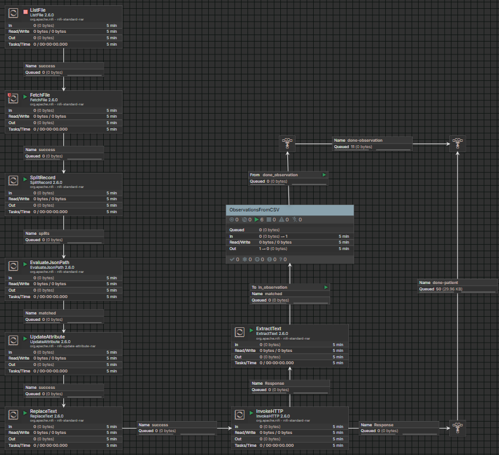

# FHIR Data Pipeline Project with Apache NiFi + HAPI FHIR + PostgreSQL

[](https://www.docker.com/)
[](https://nifi.apache.org/)
[](https://www.postgresql.org/)
[](https://hapifhir.io/)
[](#license)

---

## Overview



This project implements a **complete clinical data ingestion and integration pipeline** using:

- **Apache NiFi** → ETL orchestration
- **HAPI FHIR** → FHIR server (R4)
- **PostgreSQL** → Database backend

The pipeline automatically loads patient records from `data/patients.csv`, generating **FHIR resources (`Patient` and `Observation`)** according to the data in the CSV.

---

## Architecture

**Logical flow:**

```
patients.csv → NiFi → HAPI FHIR (Rest API) → PostgreSQL
```

**Docker Compose services:**
- **PostgreSQL (db)** → Stores all FHIR resources.
- **HAPI FHIR (hapi)** → RESTful API compliant with FHIR R4.
- **Apache NiFi (nifi)** → Handles ingestion, transformation, and loading (ETL).

---

## Project Structure

```
📁 config/                   → Configuration files
   └── hapi.application.yaml → HAPI FHIR server config
📁 data/                     → Data source CSV
   └── patients.csv
📁 nifi/
   ├── py_scripts/           → Auxiliary Python scripts
   ├── scripts/              → NiFi templates and flows
   ├── request_example/      → Sample FHIR requests
   └── FHIRInputFromCSV.json → NiFi flow export
📁 request_example/
   └── get_fhir_data.py      → Data API request example in python
📄 docker-compose.yml        → Full stack definition
📄 README.md                 → This file
```

---

## How to Run

Make sure **Docker** and **Docker Compose** are installed.

1. **Clone the repository:**
   ```bash
   git clone https://github.com/joaovictor-aragao/fhir-data-pipeline.git
   cd fhir-data-pipeline
   ```

2. **Start the services:**
   ```bash
   docker compose up -d
   ```

3. **Access the applications:**
   - **NiFi UI:** [http://localhost:8081/nifi](http://localhost:8081/nifi)
   - **HAPI FHIR Server:** [http://localhost:8080/fhir](http://localhost:8080/fhir)
   - **PostgreSQL:** `localhost:5432` (user: `admin`, password: `admin`)

4. **Stop the stack:**
   ```bash
   docker compose down
   ```

---

## NiFi Pipeline (Data Flow)

1. **ListFile / FetchFile** → Reads `patients.csv`
2. **SplitRecord** → Splits CSV rows
3. **EvaluateJsonPath** → Extracts `name`, `cpf`, `observation`, etc.
4. **UpdateAttribute** → Normalization/Validation from some fields
5. **ReplaceText (Patient)** → Builds `Patient` JSON
6. **InvokeHTTP (HAPI Patient)** → Sends `POST` to `/fhir/Patient`
7. **ExtractText** → Get Patient `id`
- **ObservationsFromCSV Group**
  8. **UpdateAttribute** → Gen field `subject_ref` from `id`
  9. **RouteOnAttribute** → Checks if `observation` exists
  10. **ReplaceText (Observation)** → Builds `Observation` JSON linked to patient
  11. **InvokeHTTP (HAPI Observation)** → Sends `POST` to `/fhir/Observation`
12. **Funnels** → Used to monitoring post on HAPI

---

## API Examples

### List all patients
```bash
curl -X GET http://localhost:8080/fhir/Patient | jq
```

### Search by CPF
```bash
curl -X GET "http://localhost:8080/fhir/Patient?identifier=01234567849" | jq
```

### Create an observation
```bash
curl -X POST "http://localhost:8080/fhir/Observation"      -H "Content-Type: application/fhir+json"      -d @nifi/request_example/sample_observation.json
```

---

## Tech Stack

| Tool | Version | Description |
|------|----------|-------------|
| **Apache NiFi** | 2.6.0 | Data flow orchestration (ETL) |
| **HAPI FHIR** | 7.6.0 (R4) | FHIR-compliant REST API |
| **PostgreSQL** | 15 | FHIR database backend |
| **Docker Compose** | latest | Container orchestration |
| **Python** | 3.12 | Auxiliary scripting |

---

## Logs and Monitoring

| Service | Access Method |
|----------|----------------|
| HAPI FHIR | `docker logs fhir-hapi` |
| PostgreSQL | `docker logs fhir-postgres` |
| NiFi | `/opt/nifi/nifi-current/logs/nifi-app.log` inside container |

---

## Author

Developed by **João Victor**  
FHIR NiFi–HAPI–PostgreSQL Pipeline Integration  
© 2025 — All rights reserved.

---

## License

This project is licensed under the **MIT License** — you are free to use, modify, and distribute it with attribution.